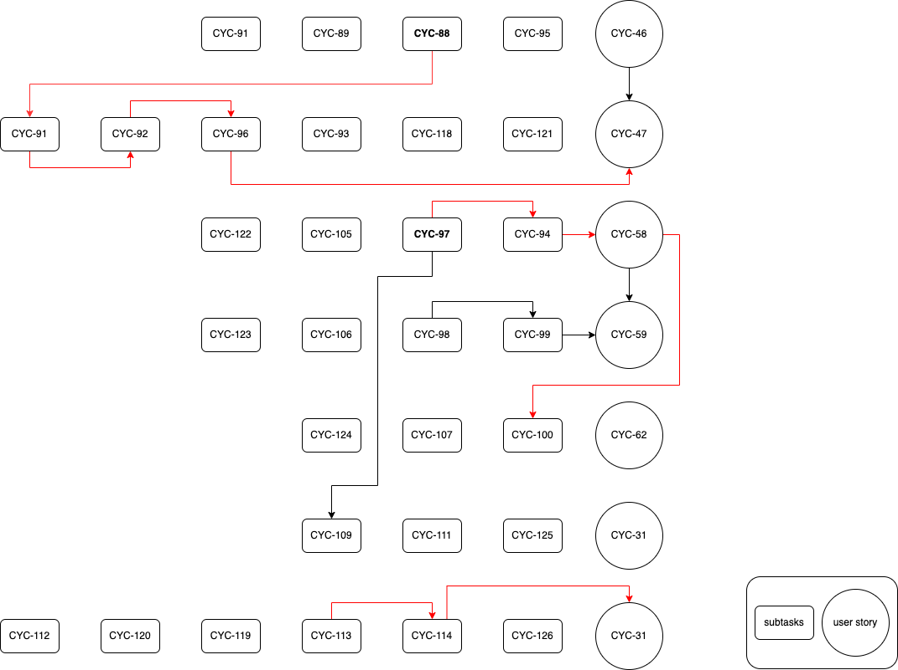

The diagram is structured top to bottom and left to right. Circles indicate user stories and rounded rectangles are subtasks of the user stories on the same row. The arrowed lines indicate the dependencies. For example CYC-88 is the dependency for CYC-91. Bold text is the start of each critical path. The unlinked subtasks in rounded rectangles mean that they are flexible and can be implemented anytime for that user story. And the intended order of implementation is preferred to be from left to right on each row and top to bottom for each user story if not linked, otherwise, the order should follow the critical path. We prioritized the tasks that located at the start of each critical path in order to minimize the delay of Sprint2 and keep the team on schedule.