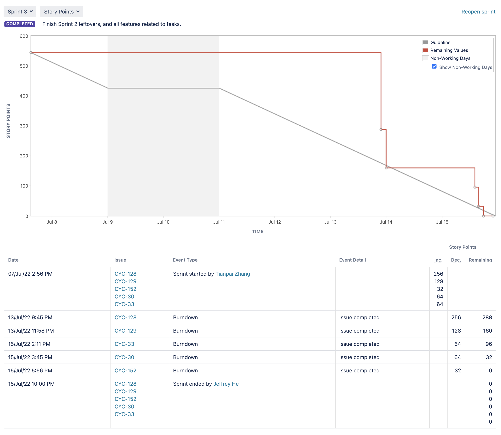

# Burndown

1. Our graph looks flat at the beginning because most of your members have
   CSCC43 midterm right after the reading week.
2. Some of us didn't update Jira in real time
3. We also planned to do QA tests before anyone can mark a user story as
   completed. That is also the reason our burn down went straight down at the
   end.

# Velocity:

For sprint 2 we have 304 points which was the way more than the sprint 1
velocity, 136. Since our team choose to work during the reading week, which make
this sprint 2 a bit longer. Additionally, more of our team members were learning
Angular to help implement the frontend interface. Therefore, we had double the
story points comparing to sprint 1.
