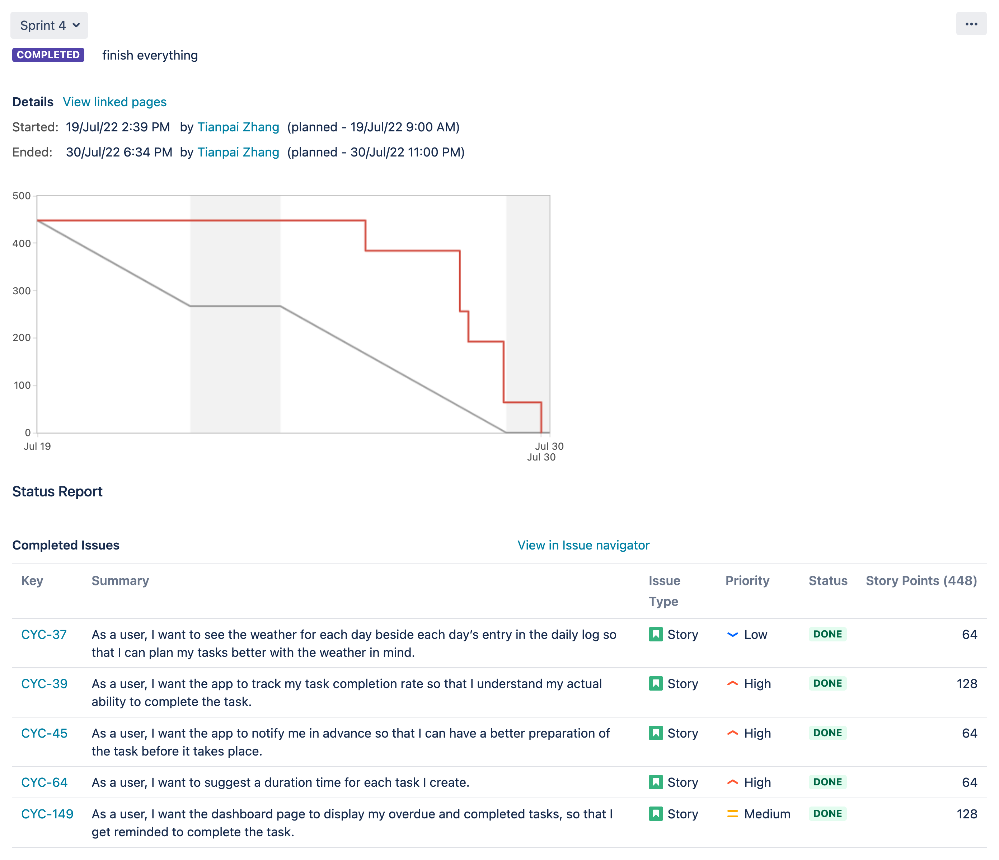

# Burndown

1. Our graph looks flat at the beginning because we were busy with assignment 2.
2. We have changed our planning strategy for this sprint. We removed the testing for each user story and do a final check in `dev` branch.

# Velocity:

For sprint 4, we had 448 points which was the slightly less than the sprint 2
velocity, 544. One reason is that this sprint is for us to complete everything and to polish, debug and
improve user experience further. 
