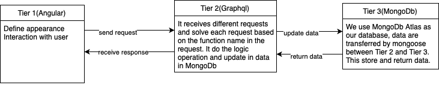

---
title:
  - CSCC01 Summer 2022 System Design
author:
  - CycList
date: Jun 30, 2022
toc: true
include-before:
- '`\newpage{}`{=latex}'
---

\newpage

#  CRC

## Backend

### Class name: app.js

Responsibility: Set up the backend server, use schema and resolver to handle each request

Collaborator: schema.js, resolver.js, auth.js

Under database folder:

{

### Class name: user.js

Responsibility: set up a database for user in mongodb, provide a connection to mongodb

Collaborator: 

### Class name: task.js

Responsibility: set up a database for task in mongodb, provide a connection to mongodb

Collaborator: 

### Class name: tag.js

Responsibility: set up a database for tag(task group) in mongodb, provide a connection to mongodb

Collaborator: 

}

Under schema folder:

{

### Class name: schema.js

Responsibility: provide all functions name the backend currently have, include arguments and  their type for each function, also provide the return type for each function.

Collaborator:

}

### Class name: auth.js

Responsibility: verify the token given from frontend, once verified, extract user id from this token and provide this user id for further action in backend

Collaborator:

Under api/resolver folder

{

### Class name: resolver.js

Responsibility: collect all function implementations that tag.js, task.js and user.js provide, so it can be used in app.js to solve each request. It should contain all functions which are listed in schema.js

Collaborator: api/resolver/task.js, api/resolver/user.js, api/resolver/tag.js

### Class name: user.js

Responsibility: provide the implementations of each function related to user in schema.js, follow the functions’ format and provide all implementations to resolver.js

Collaborator: database/user.js, database/tag.js, auth.js

### Class name: task.js

Responsibility: provide the implementations of each function related to task in schema.js, follow the functions’ format and provide all implementations to resolver.js

Collaborator: database/task.js, database/user.js, auth.js

### Class name: tag.js

Responsibility: provide the implementations of each function related to tag in schema.js, follow the functions’ format and provide all implementations to resolver.js

Collaborator: database/tag.js, database/user.js, auth.js

}

## Frontend

### Component: app.component

Responsibility: contain the entire app (all its components)

Collaborator: globals.service

### Component: globals.service

Responsibility: provides global service for methods and variables used by all components throughout the app

Collaborator: N/A

### Component: add-task.component

Responsibility: enables users to add tasks

Collaborator: globals.service

### Component: daily-log.component

Responsibility: allow users to view their tasks due within the current week

Collaborator: globals.service, task.component

### Component: dashboard.component

Responsibility: allow users to view all their tasks in an overview with the timeline

Collaborator: globals.service, task.component

### Component: future-log.component

Responsibility: allow users to view their tasks to be done in the future

Collaborator: globals.service, task.component

### Component: log-in.component

Responsibility: allow users to login to their accounts or create new accounts

Collaborator: globals.service

### Component: monthly-log.component

Responsibility: allow users to view their tasks due within the current month

Collaborator: globals.service, task.component

### Component: side-bar.component

Responsibility: allow users to navigate between the dashboard, daily, monthly, and future logs 

Collaborator: globals.service, daily-log.component, monthly-log.component, future-log.component

### Component: task.component

Responsibility: provides the format that tasks will be displayed with

Collaborator: globals.service

### Component: top-bar.component

Responsibility: provides header bar for the app with app name and logout button

Collaborator: globals.service

\newpage

# System Architecture Design
Architecture: we use Three-tiered architecture where Tier 1 is our frontend server(using Angular), Tier 2 is our backend server(using Graphql) and Tier 3 is mongodb cloud service

Three Tier Link: https://www.linuxjournal.com/article/3508

